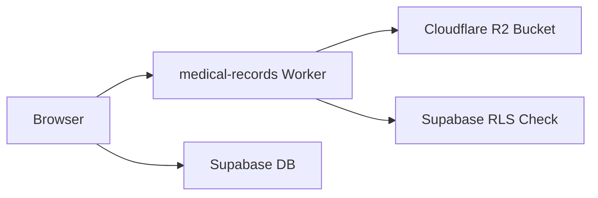
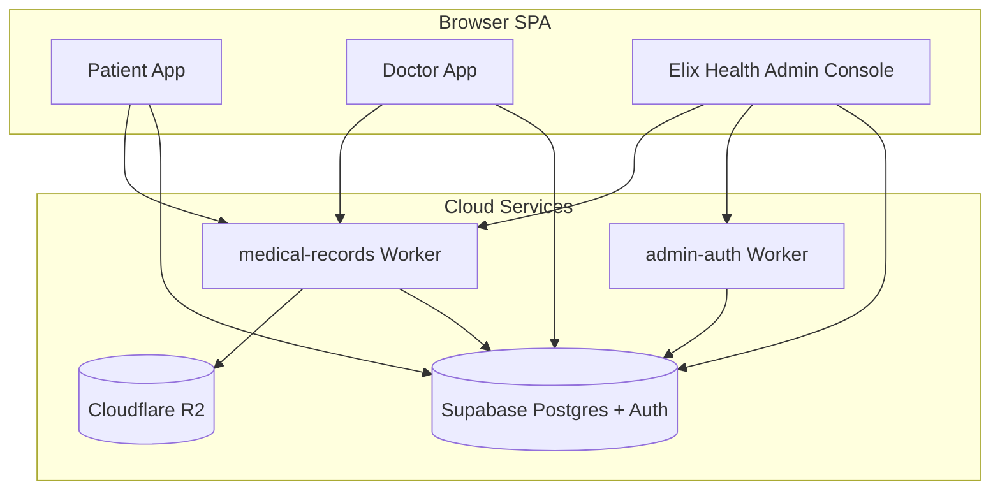

# Elix Application — Technology Stack

A categorized list of technologies used in the Elix Health application.

## Frontend (main app)

| Technology | Role |
|---|---|
| **React 18** | UI framework |
| **TypeScript** | Primary language for app source (`src/`) |
| **Vite 5** | Dev server, bundler, production build (`vite.config.js`) |
| **React Router DOM 6** | Client-side routing (patient/doctor app + `/elixhealth/*` admin console) |
| **CSS (custom)** | Main styling via `src/index.css` — Elix Health admin UI uses custom CSS, not a component library |
| **Lucide React** | Icon set (used heavily in Elix Health console) |

### Also in dependencies (partial / legacy usage)

| Technology | Notes |
|---|---|
| **Mantine UI 7** | Used in a few older/buzops components (`Staff.tsx`, `Header.tsx`, etc.) |
| **Bootstrap 5** | Present in dependencies; limited use in buzops layout |
| **Emotion** | Mantine peer dependency |
| **React Intl 6** | i18n in buzops module (`src/buzops/i18n/`) |
| **Custom i18n** | App translations in `src/i18n/appTranslations.ts` |

### PWA

| Technology | Role |
|---|---|
| **Web App Manifest** | `public/manifest.webmanifest` |
| **Sharp** | Generates PWA icons via `scripts/generate-pwa-icons.mjs` |

---

## Backend & Data

| Technology | Role |
|---|---|
| **Supabase** | Backend-as-a-service: PostgreSQL database, Auth, Row Level Security (RLS) |
| **@supabase/supabase-js** | Client SDK for auth, queries, and realtime |
| **PostgreSQL** | Database (hosted by Supabase); schema in `supabase/migrations/` |
| **Supabase Auth** | Patient, doctor, and staff login (JWT access tokens) |
| **RLS policies** | Access control for patients, doctors, admins, PSE staff, and medical records |

---

## File Storage

| Technology | Role |
|---|---|
| **Cloudflare R2** | Object storage for medical record files (PDF, images, docs) |
| **Cloudflare Workers** | Edge API for upload/download/delete of records (`workers/medical-records/`) |
| **Wrangler** | Deploy and local dev for Cloudflare Workers |

Storage flow:

---

## Edge Workers (serverless APIs)

| Worker | Path | Purpose |
|---|---|---|
| **elix-medical-records** | `workers/medical-records/` | R2 presigned upload/download; auth via Supabase JWT |
| **elix-admin-auth** | `workers/admin-auth/` | Privileged staff ops: create/manage PSE accounts, enable/disable doctor/patient logins, set passwords |

Both workers use **TypeScript** + **Wrangler** + **Cloudflare Workers runtime**.

---

## DevOps & Tooling

| Technology | Role |
|---|---|
| **Node.js** | Runtime for scripts and build |
| **npm** | Package manager |
| **ESLint** | Linting (React, hooks, refresh plugins) |
| **Vercel** | Frontend hosting config (`vercel.json`) — SPA rewrites, build output `dist/` |
| **pg (node-postgres)** | Direct Postgres connection in migration/seed scripts (`scripts/`) |
| **Node ESM scripts** | DB migrations, seeding admin/PSE accounts, R2 migrations |

---

## Application Architecture (high level)

---

## Key domains in the app

- **Patient portal** — records upload, doctor search, opinion requests
- **Doctor portal** — incoming requests, case review, availability
- **Elix Health console** (`/elixhealth`) — admin + Patient Service Executive (PSE) dashboards for doctors, patients, requests, and staff

---

## Summary list (quick reference)

1. React 18
2. TypeScript
3. Vite
4. React Router
5. CSS (custom) + Lucide icons
6. Supabase (PostgreSQL + Auth + RLS)
7. Cloudflare Workers
8. Cloudflare R2
9. Wrangler
10. Vercel (hosting)
11. Node.js / npm
12. ESLint
13. Sharp (icon generation)
14. pg (migration scripts)
15. Mantine / Bootstrap / React Intl (secondary/legacy UI areas)

No dedicated test framework, Docker, or CI pipeline configs were found in the repo root.
